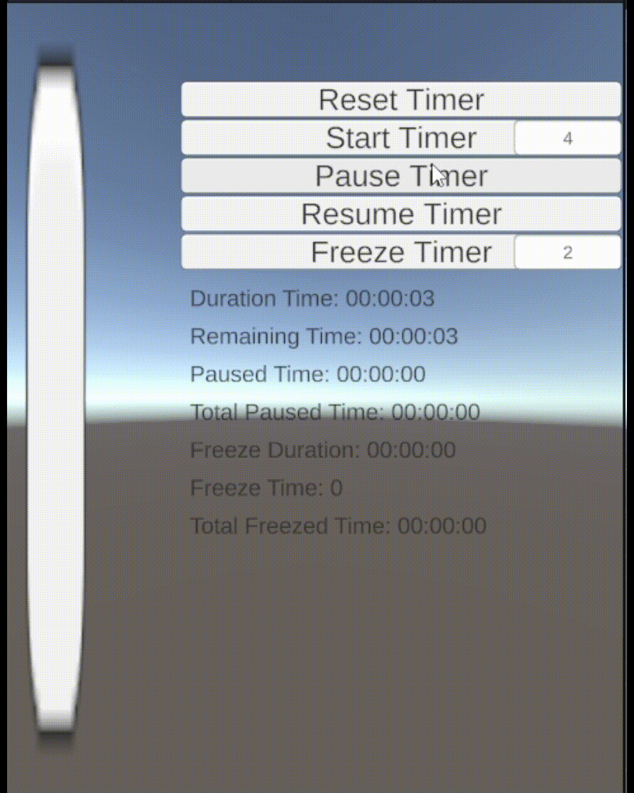

# Timer ⏲️
*Created by Eric Batlle Clavero*

Custom **Timer** made with **Unity** but that can also work outside Unity environment, fully tested and independent of Time.deltaTime or similar.

*I noticed that in many projects, it's common to track elapsed time by adding Time.deltaTime (or something similar) in an Update loop to keep track of how much time has passed. 
This approach can make games hard to test, as time becomes dependent on scene-time ticks. 
An alternative approach is to simply record the start and end times and calculate the difference, without adding anything incrementally.
And that's what this timer does.*

## Features ⏱️
- Reset Timer
- Stop Timer
- Start Timer
- Pause Timer
- Resume Timer
- **Freeze** Timer

## Freeze 🥶
The timer can be frozen for a specified duration. 
While frozen, the timer’s original duration remains paused.
Timer can be paused while freezed, and after resume the pause, freeze timer time will run, then the original time.

Check the example video below for better understanding.

## Example 🎬

  

*This video demonstrates a SampleScene containing a TimerView that showcases pausing, freezing, and both in combination.*

## Donations are appreciated! 💸
*Remember that are many ways to say thank you.*

If this timer has been helpful, remember to star the repository and consider buying me a coffee! 😀 

If you like my general work and contributions consider [sponsoring me on Github](https://github.com/sponsors/EricBatlle). 

But if you just want to donate straightforward, I also have [PayPal.me](https://paypal.me/EricBatlleClavero?locale.x=es_ES).

## How to Install :hammer_and_wrench:	
- If you want to install the whole project and check the sample scene and the code, you'll need to have **Unity** installed and updated
- After that you can just download and open the repository folder with Unity editor

## How to Use ⚙️
- Inside the Assets folder there are 2 folders, **SampleScene** and **Timer**
- **SampleScene** contains the scene visible in the example video
- **Timer** contains the **TimerModule** code
  
#### How to use the SampleScene:
- Just play the **SampleScene** scene, and click on the buttons to see how timer works
- Remember that you can specify different times for Timer and Freeze duration with the InputFields next to the buttons of Start Timer and Freeze Timer

#### How to use the Timer code:
*Tip: Review the ``Bootstrap.cs `` class for a better understanding.*

- **Timer** is just an entity class, it contains only data, and no business logic related
- **TimerService** is the opposite, is a service that provides functionalities to interact with a **Timer**, and it's dependant on **IDateTimeProvider**
- **IDateTimeProvider** and **DateTimeProvider** are the abstractions I used to get the current [UTC](https://en.wikipedia.org/wiki/Coordinated_Universal_Time) time. This is very useful to later Substitute the interface and be able to provide times on demanding.

In summary, if you want to use **Timer** in your project, be sure to initialize the service **TimerService** and the provider **DateTimeProvider**.
After that you only need to call:

``var timer = new Timer(TimeSpan.FromSeconds(X)); // being X the ammount of time duration for your timer``

And to give orders to that timer, use the Service, for example to freeze that timer, you only need to do the following:

``timerService.FreezeTimer(timer, TimeSpan.FromSeconds(Y) // being Y the ammount of freezing time duration for your timer``
